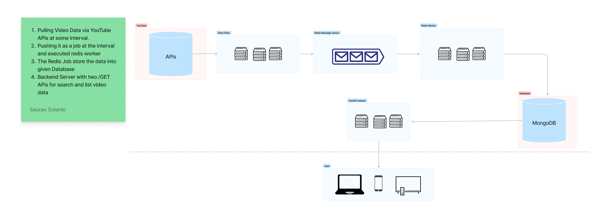
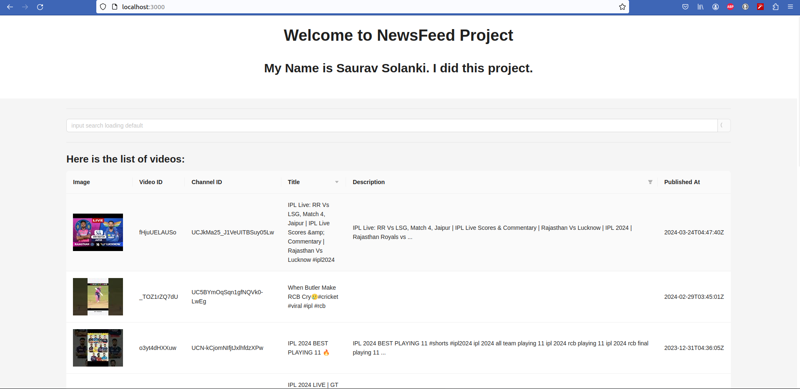

# Youtube Videos Newsfeed Infrastructure Code

This repo demonstrates:
- Calling the YouTube API continuously in background, fetching the latest videos for a predefined search query and storing it in a database.
- APIs which returns the stored video data in a paginated response sorted in descending order of published datetime.
 
## Flow/Diagram



### Images 


[Please checkout More here: ](./docs/screenshots/)

## Improvements

- [ ] Front End App View
- [ ] Optimise Search (Semantic Search)
- [ ] pep8, pre-commit hooks
- [ ] pylint
- [ ] GCP serverless Deployment
- [ ] make a Video

## Getting Started


### Dependencies

* Docker version 20.10.17, build 100c701
* docker-compose version 1.29.2, build 5becea4c
* Distributor ID: Ubuntu ,Description: Ubuntu 22.04.1 LTS ,Release: 22.04 , Codename: jammy


#### Installing
1. Prepare `.env` from `sample.env` file. 
2. Run the command: `docker-compose up -d` to spin all the process


By default, the stack exposes the following ports:
  * [FastAPI Server](http://0.0.0.0:8080)
  * [FastAPI Server Docs](http://0.0.0.0:8080/docs)
  * [Front-end Server](http://0.0.0.0:3000)
  * [Redis Dashboard](http://0.0.0.0:9181)


#### Folder Structures
```
.
├── compose.yml
├── app/ # FAST API server serving /GET APIs for search and list videos
├── data-puller/ # Pull Youtube Video Data at some interval and push to database
├── frontend/ # React App to see video data in paginated fashion
└── redis-dashboard/ # for redis dashboard view

```
### Authors
* [Saurav Solanki](https://github.com/sauravsolanki)

### Version History
* 0.0.1 : Initial Release (_**Currently**_)
